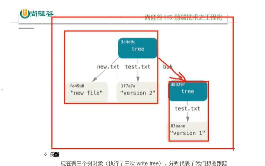
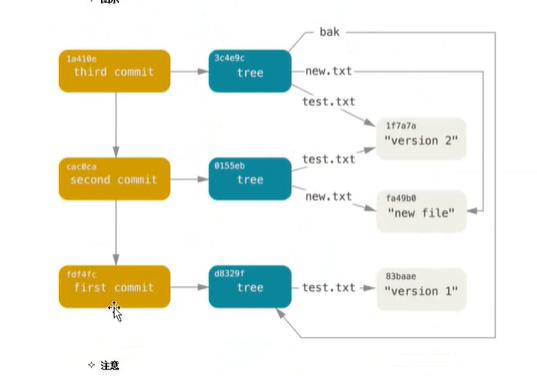

## *** git底层命令****
## git init 建立git仓库
## echo 'test' > test.txt  创建test.txt文件
## git hash-object -w ./test.txt 创建git对象，生成hash
## git update-index --add --cacheinfo l00644 "hash" "test.txt"  创git对象，存放于暂存区
    注释：100644 表明这是一个普通文件
		  100755 表示这是一个可执行文件
		  120000 表示这是一个符号链接
		  "hash" 代表git对象的hash值
		  "test.txt" 代表转换成树对象生成的文件名；
		  

## git ls-files -s 查看暂存区的当前样子
## git write-tree // 给暂存区生成一个快照，生成树对象 生成git版本库
## find "src" -type -f 查看当前路径下的文件  "src" 文件路径
## git cat-file -t | -p 'hash值'  -t 查看类型  -p查看内容
## git read-tree --prefix=bak '树hash'  将第一个树对象加入到第二个树对象。使其成为新的对象 把树读入暂存区

  git树示意图

## echo 'first-commit' | git commit-tree '树hash' 生成新的commit hash  此为commit对象
## echo 'second commit' | git commit-tree 本次提交的树hash  -p 前一次提交commit hash

 提交commit 
注释： git版本管理，对于使用人员，其实就是对提交对象commit的管理，且是链式的，树对象是版本快照

## linux 基础命令
## clear 清除屏幕
## echo 控制台输出信息
## ll 将当前目录文件平铺
## find 目录名： 将该目录下的文件平铺
## find 目录名 -type f ： 查看文件、
## rm 文件名： 删除文件
## mv 源文件  重命名文件： 重命名
## cat 文件： 查看文件内容
## vim 文件： 编辑
				按 i 进入插入模式
				按esc 进行命令执行
					q! 强制退出（不保存）
					wq 保存退出
					set nu 设置行号
					
					
## 高程命令
## git add '路径'： 生成git对象  流程 工作区--> 版本库-->暂存区
	执行了下面 一些命令
		git hash-object -w 文件名
		git update-index --add --cacheinfo ..
		
## git commit -m '注释' 生成树对象、提交对象
	执行了下面 一些命令
		git write tree
		git commit tree..

## git commit  进入编辑区
## git commit -a 跳过暂存区，直接提交
## git commit -a -m
		
## git status 检查文件状态（已跟踪(已提交、已暂存、已修改)、未跟踪）
## git diff 查看那些更新还没暂存
## git diff --cached  或者 git diff --staged 哪些更新已经暂存起来准备了下次提交

## git log 查看日志
## git log --oneline 将日志放到一行
## git log --pretty=oneline
## git log --oneline --decorate --graph --all  查看完整分支
## 取别名：git config --global alias.all  "log --oneline --decorate --graph --all"  用git all 代替
## 配置用户签名：git config --global user.name 'wzhl'
## 配置邮箱签名： git config --global user.email 'wzl@sd.com'
## 取消签名： git config --global --unset user.name
## 查看签名： git config --list

## git rm 删除已提交文件，并且将其加入暂存区  步骤  rm 文件 -->  git add 
## git mv old文件  new文件：修改文件名称，并加入暂存区

## git branch 分支名称： 创建分支
## git branch  得到分支列表
## git branch -D 分支名称：  强制删除分支
## git branch -d name 删除空分支或已提交的分支
## git branch -v 查看最后一次提交
## git branch 分支名称 提交的hash  回到某个分支版本
## git branch --merged 查看哪些分支已经被合并了
## git branch --no-merged 查看哪些分支未被合并

## 分支的本质：其实就是 一个提交对象，HEAD:是一个指针，默认指向master,切换分支就是指向不同的分支，每次有新的提交对象，HEAD都会带新的提交对象移动

## git checkout 分支名称： 切换分支
## git checkout -b 分支名称  代表新建分支，并切换分支
## git restore <file> | git checkout <file>工作区撤回前一版本
## git restore --staged <file>  暂存区撤回
## git commit --amend  版本库撤回，包含以下情况(提交注释写错了)

## reset 三部曲

	第一部： git reset --soft HEAD~  撤回上一次提交，只改变了HEAD指向，带着分支一起移动
	第二部： git reset --mixed HEAD~ | "filename可选"  撤回上一次提交，还会取消暂存区所以东西，于是回滚到所以的git add 和git commit的命令之前（改变HEAD 和 暂存区）
	第三部： git reset --hard HEAD~ 撤回上一次提交 改变HEAD 、暂存区和工作区
	
	
## 数据恢复  使用git branch 分支  commithash
## 打tag
	git tag  查看tag列表
	git tag v1.0  标记tag
	git show tag名称  查看标签
	git tag -d tag名称  删除tag
	git checkout -b tag名称  检出标签（HEAD）

##创建.gitignore 忽略文件,在内部写忽略文件 /node_modules

##git merge '分支' 快进合并 

##git存储操作方式栈的方式）
## git stash  将未完成的工作存储在栈里面
## git stash list 查看存储列表
## git stash drop  '存储名'  根据储存名删掉
## git stash pop 应用储存后，立即扔掉
## git stash apply '存储名'  如果不指定存储名，则应用最近的

## 远程仓库
## git remote -v 查看别名
## 配置别名 git remote add '别名' '远程仓库地址'
## 本地仓库推送到远程仓库 git push '别名' master
## 克隆仓库 git clone '仓库url地址'
## 更新项目文件 git fetch '别名'
## git pull 拉取
## git branch -u '别名' 跟踪远程分支
## git branch -vv 是否有跟踪分支

## 团队协作
	1.项目经理初始化远程仓库、一定要初始化一个空的仓库、在github上操作、
	2.项目经理创建本地仓库
		git remote add '别名' '仓库地址'
		git init
		将源码复制进来
		修改用户名、邮箱
		git add
		git commit
	3.项目经理推送本地仓库到远程仓库
		清理window凭据
		git push '别名' '分支'（推送完后，会生成远程跟踪分支）
	4.在github邀请项目成员
		
	5.成员克隆远程仓库
		git clone '仓库地址'（在本地生成.git文件，默认远程仓库配了别名 orgin）
	6.成员做出贡献
		修改源码文件
		git push '别名' '分支'
	7.项目经理更新修改
		git fetch '别名'(将修改同步到远程跟踪分支上)
		git merge '远程分支'
		
## 本地分支如何跟踪一个远程分支
	1.当克隆的时候，会自动生成一个master本地分支（已经跟踪了对应的远程跟踪分支）
	2.在新建其它分支时，可以指定想要的远程跟踪分支
		git checkout -b 本地分支  远程跟踪分支  
		或者： git checkout --track 远程跟踪分支
	3.将一个已经存在的本地分支改成一个跟踪分支
		git branch -u 远程跟踪分支

## 冲突
	git 本地操作会不会有冲突： 典型合并的时候
	git 远程协作冲突
		pull
		push

##****************底层命令总结**********************
##git对象
	git hash object -w 'fileUrl'  生成一个key（hash值） val(压缩文件内容)键值存入到.git/objects文件中
##tree对象
	git update-index --add --cacheinfo 100644 'hash' 'fileUrl' 往暂存区添加一条新的记录(git对象，对应上文件名称，存入到.git/index)
	git write-tree  生成树对象存到.git/objects
##commit对象
	git 'memo注释' | git commit-tree 'tree-hash';
	
## 查看暂存区
	git ls-files -s;
	
##对象查询
	git cat-file -p 'hash' 查看当前hash的内容
	git cat-file -t 'hash' 查看当前hash类型

##文件查询
	find .git/objects 查看当前目录下的全部文件，包含文件夹
	find .git/objects -type f 查看当前文件下的全部文件，不包含文件夹
	
	
##*******高程命令**************
